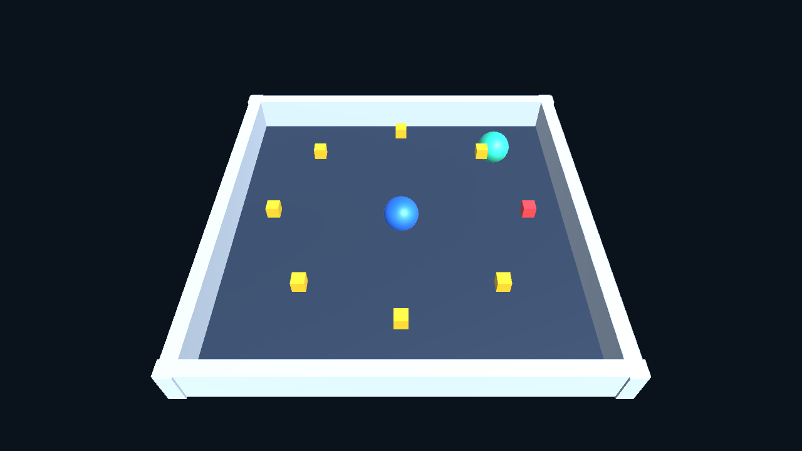

# Unity RL Demo

[中文](README.md) | [English](README.en.md)

基于 **Unity 6000.6.4f1** 的滚球与追逐演示，包含可选的 Python 强化学习训练代码和 Unity MCP 插件。



## 运行演示

1. 下载或克隆仓库，在 Unity Hub 中添加仓库内的 `Project` 文件夹。
2. 使用 Unity **6000.6.4f1** 打开，等待资源导入和脚本编译完成。
3. 打开 `Assets/Scenes/ChaseGame.unity`，点击 ▶ Play，再点击 Game 画面左上角的 **Auto chase demo**。
4. 蓝球自动追逐绿球；用 **WASD 或方向键**移动绿球，躲避蓝球并拾取小方块。

点击 **Switch environment** 切换至滚球场景；点击 **Keyboard test**，用键盘控制蓝球到达红色目标。没有训练模型时，**Trained AI** 按钮不可用。

演示本身不需要安装 Python，不需要启动 MCP 服务。

## 项目结构

| 目录 | 内容 |
| --- | --- |
| `Project/Assets/Scenes` | RollerBall 和 ChaseGame 两个场景 |
| `Project/Assets/Scripts` | 物理控制、规则追逐、界面、自定义训练连接及 JSON 策略推理 |
| `Project/Assets/Editor` | 场景生成、Windows 构建和 MCP 连接工具 |
| `Project/Packages` | Unity 依赖与嵌入的 Unity MCP 10.0.0 插件 |
| `Project/ProjectSettings` | Unity 项目设置 |
| `Project/Training` | 可选的 Stable-Baselines3 PPO 训练程序 |

Unity 缓存、Python 环境、日志、训练结果和 Windows 编译产物不纳入仓库。Unity 的 `.meta` 文件已保留。

## 可选：连接 MCP

插件来自 [CoplayDev/unity-mcp](https://github.com/CoplayDev/unity-mcp)，固定版本 **10.0.0**。安装 `uv` 后运行仓库根目录的 `Start-MCP.cmd`，启动本地服务。

服务地址：`http://127.0.0.1:8808/mcp`。在 Unity 菜单选择 **RL Lab > Connect Codex MCP**，并将 MCP 客户端连接到该地址。8808 端口需要可用。

嵌入插件的原始 MIT 许可证见 [docs/licenses/unity-mcp-MIT.txt](docs/licenses/unity-mcp-MIT.txt)。本仓库未对其他代码额外授予开源许可证。

## 可选：强化学习实验

训练代码使用 **Python 3.12、Stable-Baselines3 2.4.1、Gymnasium 1.0.0** 和自定义 Unity TCP 连接。原本机环境验证使用 PyTorch 2.3.1；训练器使用 CPU。建议创建独立环境，避免影响现有 Python 环境。

在仓库根目录执行以下 PowerShell 命令（需已有 Python 3.12）：

```powershell
py -3.12 -m venv TrainingEnv
.\TrainingEnv\Scripts\python.exe -m pip install "torch==2.3.1" "numpy<2" tensorboard
.\TrainingEnv\Scripts\python.exe -m pip install -r .\Project\Training\requirements.txt
```

训练前需要构建专用 Windows 环境，演示窗口不能代替训练环境。先关闭打开该项目的 Unity 编辑器，将以下 `$unityEditor` 改为实际安装路径：

```powershell
$unityEditor = 'C:\Program Files\Unity\Hub\Editor\6000.6.4f1\Editor\Unity.exe'
$projectPath = (Resolve-Path .\Project).Path
& $unityEditor -batchmode -quit -projectPath $projectPath -executeMethod LabSetup.BuildTraining -labScene roller -logFile "$projectPath\build-roller.log"
& $unityEditor -batchmode -quit -projectPath $projectPath -executeMethod LabSetup.BuildTraining -labScene chase -logFile "$projectPath\build-chase.log"
```

确认日志内构建结果为 `Succeeded` 后，再选择一个实验执行：

```powershell
.\TrainingEnv\Scripts\python.exe .\Project\Training\train.py --scene roller --steps 100000
# 或者：
.\TrainingEnv\Scripts\python.exe .\Project\Training\train.py --scene chase --steps 500000
```

每个训练环境包含 16 个独立场地；观察量为 8 维，动作为平面方向上的 2 维连续力。奖励为到达目标 +1，跌落或超时为 0，每次动作推进 10 个物理帧。训练前后的策略评估报告保存到 `Project/results`。训练后保存 PPO 模型和供 C# 读取的 JSON 权重，**不生成 ONNX**。

训练器会启动本机 TCP 服务连接，默认端口 9005。训练代码目前保留作为后续实验入口，未执行完整训练；不能据此声称已经得到有效策略。

## 已验证范围

- Unity 脚本编译，以及滚球、追逐训练环境和 Windows 演示构建成功。
- 规则追逐演示可运行，Python 依赖可导入。
- Unity MCP 在本机连接成功。
- 尚未验证完整 PPO 训练效果；不同机器需重新安装依赖和构建。
